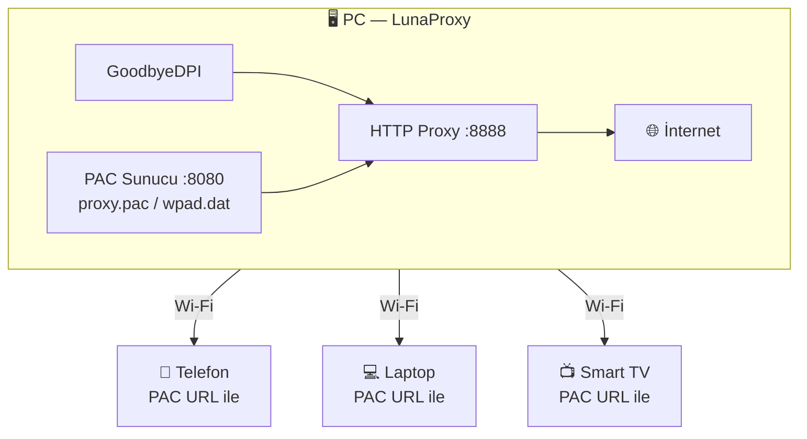



# LunaProxy

**Windows için GoodbyeDPI tabanlı DPI Bypass Proxy**

Engellenen sitelere PC'den ve aynı Wi-Fi ağındaki tüm cihazlardan (telefon, tablet, TV) ek uygulama kurmadan erişin.

[⬇️ İndir](#kurulum) · [Nasıl Çalışır?](#nasıl-çalışır) · [Router Kurulumu](#router-kurulumu)

---

## Ne İşe Yarar?

LunaProxy, internet servis sağlayıcılarının (TTNet, Turkcell, Vodafone, Superonline vb.) DPI (Deep Packet Inspection) yöntemiyle uyguladığı bant genişliği kısıtlamalarını ve site engellerini **tek tıkla** aşmanızı sağlar.

- **PC'de çalışır, ağdaki her cihazı korur.** Telefon, tablet veya Smart TV'nize hiçbir şey kurmanız gerekmez — sadece Wi-Fi ayarlarından PAC URL'ini girin.
- **GoodbyeDPI entegrasyonu.** Dünya genelinde milyonlarca kullanıcının güvendiği açık kaynak motoru kullanır.
- **Otomatik ISP algılama.** Kullandığınız operatörü otomatik tespit eder, en uygun DPI bypass modunu seçer.
- **Router desteği.** SSH üzerinden router'ınıza bağlanıp tüm ağı otomatik olarak yapılandırabilir.

---

## Özellikler

| Özellik | Açıklama |
|---------|----------|
| 🛡️ **DPI Bypass** | GoodbyeDPI ile derin paket incelemesini engeller |
| 📡 **PAC Proxy Sunucu** | Aynı ağdaki tüm cihazlar için otomatik proxy yapılandırması |
| 🔍 **ISP Algılama** | TTNet, Turkcell, Vodafone, Superonline ve diğerleri için optimize edilmiş modlar |
| 🌐 **QR Kod** | Mobil cihazlar için tek dokunuşla proxy kurulumu |
| 🔧 **Router Kurulumu** | SSH ile OpenWrt/Entware router'lara otomatik kurulum |
| 🔄 **Otomatik Güncelleme** | Yeni sürüm çıktığında bildirim |
| 🚀 **Sistem Başlangıcı** | Windows açılışında otomatik başlatma |
| 🎨 **Modern Arayüz** | WebView2 tabanlı karanlık tema UI |

---

## Kurulum

### Gereksinimler

- **Windows 10** (v1809+) veya **Windows 11**
- **Microsoft Edge WebView2 Runtime** — Windows 11'de zaten yüklüdür. Windows 10 için [buradan indirin](https://go.microsoft.com/fwlink/p/?LinkId=2124703)
- Yönetici (Admin) yetkisi

### İndirme ve Kurulum

1. **[Releases](https://github.com/Anilyldrmm/LunaProxy/releases/latest)** sayfasından `LunaProxy_Setup_vX.X.X.exe` dosyasını indirin
2. Kurulum sihirbazını çalıştırın (yönetici yetkisi isteyecektir)
3. Kurulum tamamlandıktan sonra LunaProxy otomatik başlar

> **Windows Defender uyarısı:** GoodbyeDPI içerdiği için bazı antivirüs yazılımları yanlış pozitif verebilir. Bu normaldir. Güvende olmak istiyorsanız [kaynak kodunu](#kaynak-koddan-derleme) kendiniz derleyebilirsiniz.

---

## Nasıl Çalışır?

1. LunaProxy başlatıldığında GoodbyeDPI'yi arka planda çalıştırır
2. Yerel bir HTTP proxy sunucusu (port 8888) ve PAC sunucusu (port 8080) açar
3. Diğer cihazlar PAC URL'ini kullanarak bu proxy üzerinden internete bağlanır
4. PAC sunucusu hangi sitelerin proxy üzerinden geçeceğini otomatik belirler

### Mobil Cihazlarda Kullanım

1. LunaProxy'de **QR** sekmesine geçin
2. QR kodu telefon kamerasıyla okutun
3. Açılan sayfadaki talimatları izleyin

**Manuel kurulum:** Wi-Fi ayarlarından "Proxy" → "Manuel" seçin, PAC URL olarak `http://[PC-IP]:8080/proxy.pac` girin.

---

## Router Kurulumu

Tüm ağı (modem üzerinden bağlanan her cihazı) otomatik olarak proxy'ye yönlendirmek için:

1. **Router** sekmesine geçin
2. Router IP adresinizi (genellikle `192.168.1.1`), SSH kullanıcı adı ve şifrenizi girin
3. **Kur** butonuna tıklayın

LunaProxy SSH üzerinden router'ınıza bağlanır ve gerekli scriptleri otomatik kurar.

**Desteklenen router'lar:**
- OpenWrt (Entware ile lighttpd)
- Sistem httpd veya BusyBox httpd içeren her Linux tabanlı firmware
- Python 3/2 yüklü her router

---

## Ekran Görüntüleri

---

## Gizlilik

LunaProxy **hiçbir veriyi dışarıya göndermez.** Tüm trafik yerel ağınızda kalır. Güncellemeler için yalnızca GitHub Releases API'si sorgulanır.

---

## Lisans

MIT — bkz. [LICENSE](LICENSE)

---

GoodbyeDPI motoru için [ValdikSS](https://github.com/ValdikSS/GoodbyeDPI)'e teşekkürler.

**LunaProxy**, SpAC3 tarafından geliştirilmektedir.

